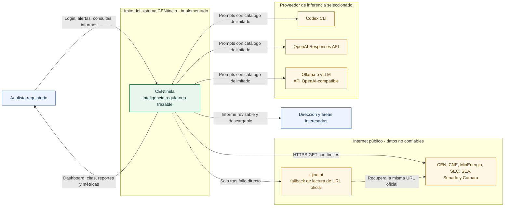
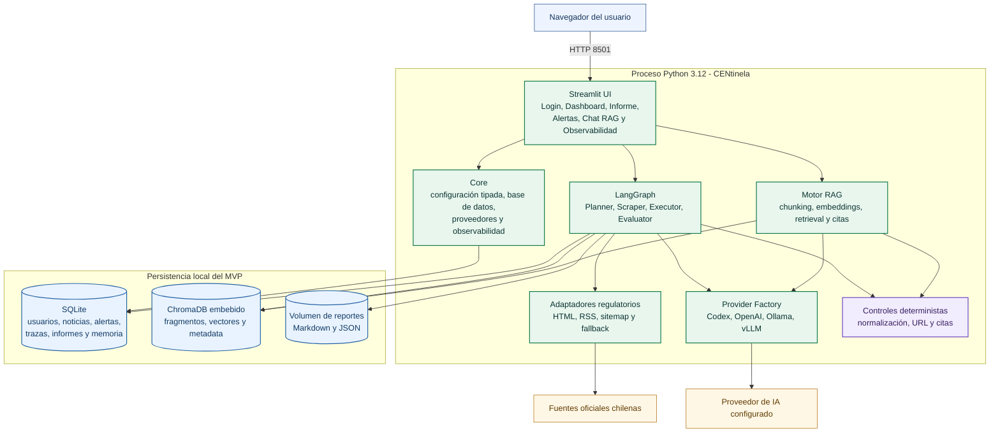
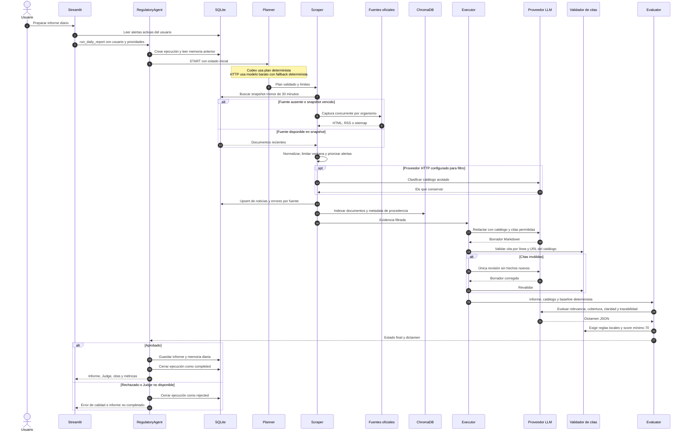
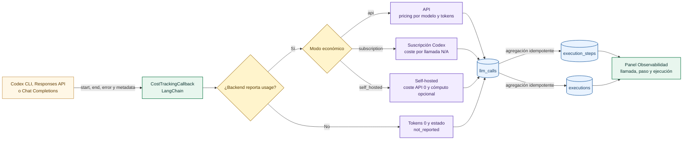
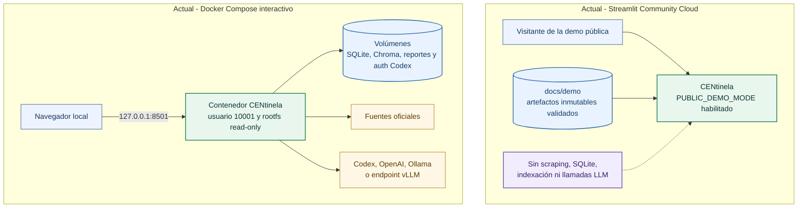
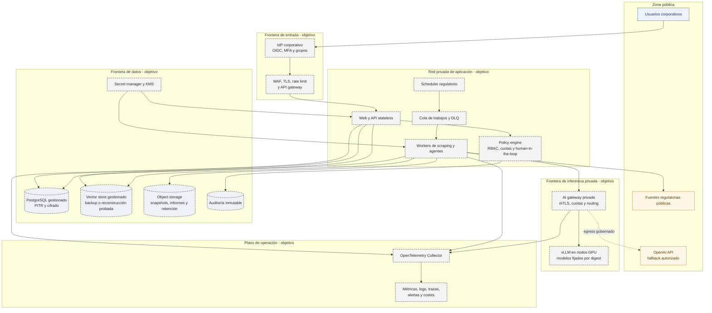

# Arquitectura de CENtinela

## Resumen ejecutivo

CENtinela es un MVP de inteligencia regulatoria para el Sistema Eléctrico
Nacional de Chile. Convierte publicaciones públicas de siete fuentes oficiales
en un catálogo trazable, un informe diario con control de calidad y un canal RAG
para consultas ad-hoc. La decisión arquitectónica central es que el modelo nunca
sea la autoridad de procedencia: las URLs nacen en la captura, se conservan como
metadatos y se validan localmente antes de aceptar una afirmación.

Este documento separa de forma explícita tres estados:

| Estado | Significado |
|---|---|
| **Implementado - interactivo** | Código ejecutable del repositorio, con SQLite, ChromaDB, fuentes en vivo y un proveedor de IA configurable. |
| **Implementado - replay público** | Despliegue de demostración en solo lectura que reproduce artefactos validados y no llama a fuentes, modelos ni bases persistentes. |
| **Objetivo de producción** | Arquitectura recomendada; no forma parte del despliegue actual y requiere trabajo adicional. |

La arquitectura detallada se complementa con
[STACK_TECNOLOGICO.md](STACK_TECNOLOGICO.md),
[DECISIONES_TECNICAS.md](DECISIONES_TECNICAS.md),
[CLOUD_ARCHITECTURE.md](CLOUD_ARCHITECTURE.md) y
[SECURITY.md](SECURITY.md).

## 1. Principios y decisiones de diseño

1. **Evidencia antes que generación.** Cada afirmación material debe terminar
   con una cita `[Fuente | URL]` que pertenezca al catálogo recuperado.
2. **Flujo cerrado y auditable.** LangGraph compila una secuencia fija, sin
   herramientas autónomas abiertas ni bucles no acotados.
3. **Calidad fail-closed.** Un informe no aprobado por el LLM-as-Judge y por las
   reglas deterministas no se guarda como completado.
4. **Portabilidad de inferencia.** Codex, OpenAI API, Ollama y vLLM comparten un
   contrato interno; proveedor y modelo pueden resolverse por rol.
5. **Economía explícita.** Coste API, cuota de suscripción y cómputo self-hosted
   se registran como categorías distintas.
6. **Degradación visible.** Una fuente caída, uso de proxy de lectura, tokens no
   reportados o un fallback extractivo quedan identificados en estado y trazas.
7. **MVP reproducible.** SQLite y Chroma embebido reducen dependencias para una
   instancia; no se presentan como una solución multi-réplica de producción.

## 2. Contexto del sistema

El diagrama muestra el contexto del modo interactivo. Solo se utiliza el
proveedor configurado para cada rol; las cuatro alternativas no tienen por qué
estar activas simultáneamente.



### Fuentes regulatorias implementadas

| Clave | Organismo | Canales utilizados | Control de procedencia |
|---|---|---|---|
| `cen` | Coordinador Eléctrico Nacional | novedades y sitemap RSS | allowlist de hosts `coordinador.cl` |
| `cne` | Comisión Nacional de Energía | prensa, feed y sitemap | allowlist de hosts `cne.cl` |
| `minenergia` | Ministerio de Energía | noticias | allowlist `energia.gob.cl` |
| `sec` | Superintendencia de Electricidad y Combustibles | feed y noticias | allowlist de hosts `sec.cl` |
| `sea` | Servicio de Evaluación Ambiental | noticias y RSS | allowlist de hosts `sea.gob.cl` |
| `senado` | Senado de la República | tramitación y portal legislativo | allowlist de dominios del Senado |
| `camara` | Cámara de Diputadas y Diputados | proyectos de ley y portada oficial | allowlist de hosts `camara.cl` |

La implementación está en
[`scrapers/chile_regulatory.py`](scrapers/chile_regulatory.py). Las siete fuentes
se consultan en paralelo, pero se normalizan en un orden estable. Un fallo queda
aislado por organismo. El fallback no aporta contenido sintético: utiliza un
proxy de lectura sobre la URL oficial y marca `is_fallback` y
`fallback_reason`.

## 3. Contenedores y componentes del MVP implementado



### Responsabilidad por módulo

| Módulo | Responsabilidad | Dependencias que no atraviesan su frontera |
|---|---|---|
| [`app.py`](app.py) | Experiencia Streamlit, sesión, páginas, acciones y descargas | No implementa parsers web ni lógica de pricing. |
| [`core/config.py`](core/config.py) | Configuración, validación de secretos, routing y pricing | No invoca modelos ni persiste negocio. |
| [`core/database.py`](core/database.py) | Repositorio SQLite, autenticación local y trazas | No construye prompts ni scrapea. |
| [`core/providers/`](core/providers/) | Contrato común y adaptadores de inferencia/embeddings | No conoce Streamlit ni el dominio regulatorio. |
| [`core/observability.py`](core/observability.py) | Callback LangChain, tokens, latencia y coste | No estima tokens a partir de caracteres. |
| [`scrapers/chile_regulatory.py`](scrapers/chile_regulatory.py) | Captura, parsing y normalización de fuentes oficiales | No redacta conclusiones regulatorias. |
| [`agent/graph.py`](agent/graph.py) | Orquestación, barreras de calidad y persistencia del informe | No acopla el workflow a un SDK de modelo concreto. |
| [`agent/tools.py`](agent/tools.py) | Reglas puras de filtrado, citas y fallbacks | No realiza llamadas externas. |
| [`rag/vector_engine.py`](rag/vector_engine.py) | Indexación, recuperación, respuesta y trazabilidad RAG | No acepta URLs libres generadas por el modelo. |

## 4. Secuencia del informe diario

La topología compilada es exactamente `START -> planner -> scraper -> executor
-> evaluator -> END`. Las revisiones están dentro de los nodos y están acotadas
a un único intento.



### Invariantes del workflow

- Planner siempre incluye CEN, CNE, MinEnergia, SEC, SEA, Senado y Cámara.
- El catálogo entregado al Executor está limitado en volumen y caracteres.
- Una cita es válida solo si fuente y URL canonicalizada coinciden con la
  evidencia de la ejecución.
- Executor puede revisar una vez; Evaluator puede sustituir una vez un borrador
  rechazado por un informe extractivo y volver a juzgarlo.
- Un fallo del Judge no se convierte en aprobación determinista.
- Solo un resultado aprobado alimenta `reports`, `daily_memory` y los artefactos
  descargables.

## 5. Flujo RAG y trazabilidad

```mermaid
flowchart LR
    subgraph INDEX["Indexación - implementada"]
        DOC["Documento normalizado"]:::implemented
        CHUNK["Chunks de 1.200 caracteres<br/>solape de 160"]:::implemented
        EMB["Embedding identificado por<br/>proveedor y modelo"]:::implemented
        META["Metadata: fuente, URL original,<br/>fecha, temas y hash"]:::control
        STORE[("ChromaDB<br/>cosine HNSW")]:::store
        DOC --> CHUNK
        CHUNK --> EMB
        DOC --> META
        EMB --> STORE
        META --> STORE
    end

    subgraph QUERY["Consulta - implementada"]
        Q["Pregunta ad-hoc"]:::actor
        RET["Recuperación vectorial<br/>más señal léxica y diversidad de fuentes"]:::implemented
        FALLBACK["Fallback léxico"]:::implemented
        CATALOG["Contextos numerados<br/>y citas permitidas"]:::control
        GEN["Respuesta estructurada<br/>claims y source_ids"]:::implemented
        BUILD["Construcción local de<br/>Fuente y URL"]:::control
        CHECK["Validación determinista<br/>de cada afirmación"]:::control
        ANSWER["Respuesta y fuentes<br/>con URLs originales"]:::implemented
        Q --> RET
        STORE --> RET
        RET -.->|"Error vectorial"| FALLBACK
        RET --> CATALOG
        FALLBACK --> CATALOG
        CATALOG --> GEN
        GEN --> BUILD
        BUILD --> CHECK
        CHECK -->|"Válida"| ANSWER
        CHECK -.->|"Inválida o LLM no disponible"| EXTRACT["Respuesta extractiva citada"]:::implemented
        EXTRACT --> ANSWER
    end

    classDef actor fill:#eef4ff,stroke:#315b96,color:#17365d;
    classDef implemented fill:#e8f6ee,stroke:#137a4a,color:#0c3330,stroke-width:1.5px;
    classDef control fill:#f2ecff,stroke:#6b46c1,color:#35205f,stroke-width:1.5px;
    classDef store fill:#e9f3ff,stroke:#2563a5,color:#123b64,stroke-width:1.5px;
```



El embedding predeterminado es `centinela-local-hash-v1-1536d`, sin red ni
secretos. También existen adaptadores para OpenAI, Ollama y vLLM. Cada fragmento
incluye la identidad del embedding y una consulta filtra por ese valor, evitando
mezclar espacios vectoriales incompatibles. La respuesta estructurada no permite
que el modelo escriba URLs: devuelve `source_ids` y la aplicación reconstruye
las citas desde los contextos recuperados.

## 6. Observabilidad y tokenomics



Para una llamada API, con precios por millón de tokens:

```text
cost_usd = prompt_tokens / 1_000_000 * input_price
         + completion_tokens / 1_000_000 * output_price

cost_clp = cost_usd * 940
```

Los contadores proceden del campo `usage` del backend. No se aproximan por
longitud del prompt. Si el backend no informa uso, los contadores quedan en cero
con `token_usage_status=not_reported`; cero no se interpreta como ausencia de
consumo. La semántica económica completa está en
[DECISIONES_TECNICAS.md](DECISIONES_TECNICAS.md).

## 7. Despliegue actual

Existen dos perfiles actuales con objetivos distintos.



El replay público es evidencia de interfaz y de una ejecución histórica, no una
ejecución en vivo. El perfil interactivo sí habilita captura, generación,
persistencia y RAG cuando el proveedor elegido está autenticado y saludable.

## 8. Objetivo de producción y fronteras de confianza

El siguiente diagrama es una **propuesta de evolución; sus componentes no están
implementados en este repositorio**.



### Matriz de evolución

| Capacidad | MVP implementado | Objetivo de producción |
|---|---|---|
| Identidad | Usuario local, PBKDF2-HMAC-SHA256 y sesión Streamlit | SSO/OIDC, MFA, RBAC y ciclo de alta/baja corporativo |
| Cómputo | Un proceso Streamlit y ejecución síncrona | Web stateless, scheduler, workers, cola y DLQ |
| Datos | SQLite, Chroma embebido y volúmenes | PostgreSQL con PITR, vector store resiliente y object storage |
| Inferencia | Codex/OpenAI/Ollama/vLLM por configuración | AI gateway privado, versionado, canary, cuotas y autoscaling GPU |
| Secretos | Variables de entorno y `SecretStr` | Secret manager, KMS, rotación y acceso por workload identity |
| Observabilidad | Trazas funcionales en SQLite y UI | OpenTelemetry, backend externo, SLO, alertas y auditoría inmutable |
| Seguridad de red | Puertos locales en loopback y contenedor endurecido | WAF, TLS, mTLS, NetworkPolicy y egress allowlist |
| Gobierno | Citas, Judge y revisión humana declarada | Policy engine, aprobación formal, retención, DLP y evaluación continua |

## 9. Controles de seguridad por frontera

| Frontera | Control implementado | Deuda antes de producción |
|---|---|---|
| Usuario -> aplicación | Autenticación local, hash con sal, comparación constante y datos por usuario | OIDC, MFA, RBAC, protección CSRF formal y gestión de sesiones corporativa |
| Aplicación -> fuentes | Solo HTTP(S), allowlist por organismo, límites, timeout y sanitización | Egress proxy, robots/ToS governance, snapshots firmados y alertas por parser |
| Documento -> prompt | Catálogo delimitado tratado como dato no confiable | Detección adversarial, clasificación y redacción centralizada |
| Modelo -> respuesta | JSON Schema cuando existe, `source_ids`, allowlist de citas y Judge fail-closed | Modelo Judge independiente, benchmark dorado y aprobación humana formal |
| Aplicación -> proveedor | Secretos excluidos de configuración pública y errores sanitizados | Secret manager, workload identity, mTLS y contratos de tratamiento de datos |
| Contenedor -> host | UID no root, rootfs read-only, capabilities eliminadas y `no-new-privileges` | Imagen por digest, SBOM, firma, escaneo continuo y políticas de admisión |
| Persistencia | Claves foráneas, WAL y escrituras transaccionales | Cifrado gestionado, backup probado, PITR, retención y auditoría inmutable |

## 10. Límites arquitectónicos conocidos

- La autenticación local no sustituye identidad corporativa.
- SQLite y Chroma embebido limitan la concurrencia y la alta disponibilidad.
- El workflow se ejecuta de forma síncrona; no hay scheduler, cola ni workers en
  la entrega.
- El panel de alertas configura reglas y prioriza evidencia; no envía correo,
  Slack ni notificaciones push.
- El proxy de lectura mejora disponibilidad, pero sigue dependiendo de Internet
  y debe revisarse contractual y operativamente para producción.
- Una cita válida acredita procedencia, no demuestra por sí sola que la
  interpretación jurídica o económica sea correcta.
- Los modelos abiertos están integrados por contrato, pero su calidad no se
  considera promovida sin ejecutar el benchmark dorado en hardware
  representativo.
- La demo cloud es un replay histórico de solo lectura y no prueba operación
  continua de scraping o inferencia en Streamlit Community Cloud.

## 11. Evidencia verificable

- Grafo y barreras: [`agent/graph.py`](agent/graph.py) y
  [`agent/tools.py`](agent/tools.py).
- RAG y trazabilidad: [`rag/vector_engine.py`](rag/vector_engine.py).
- Fuentes: [`scrapers/chile_regulatory.py`](scrapers/chile_regulatory.py).
- Persistencia y autenticación: [`core/database.py`](core/database.py).
- Métricas y coste: [`core/observability.py`](core/observability.py).
- Runtime y proveedores: [`core/providers/`](core/providers/) y
  [`core/codex_client.py`](core/codex_client.py).
- Hardening y perfiles: [`Dockerfile`](Dockerfile),
  [`docker-compose.yml`](docker-compose.yml) y
  [`docker-compose.ollama.yml`](docker-compose.ollama.yml).
- Evidencia reproducible: [`docs/demo/`](docs/demo/) y
  [`.github/workflows/ci.yml`](.github/workflows/ci.yml).
