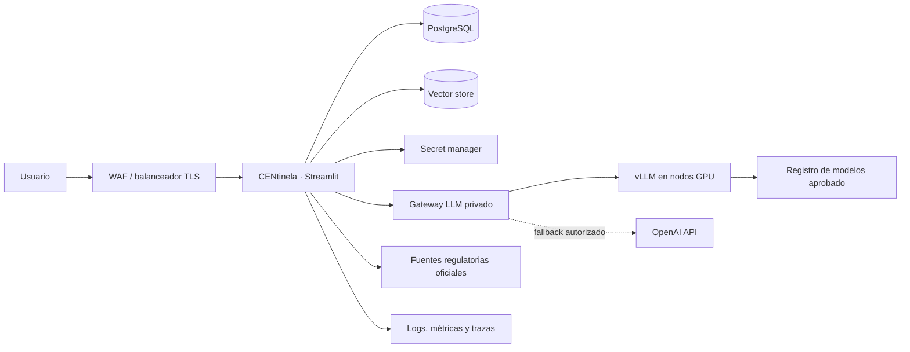

# Arquitectura cloud y ejecución con modelos abiertos

## Resumen ejecutivo

CENtinela separa la aplicación del proveedor generativo. La misma imagen de la
aplicación puede operar con la sesión Codex, OpenAI API, Ollama o un endpoint
compatible con OpenAI servido por vLLM. La elección es configuración de
despliegue: los scrapers, el catálogo de evidencia, las citas, ChromaDB, SQLite
y la observabilidad no deben conocer el SDK concreto.

La recomendación es utilizar Ollama para desarrollo, demos desconectadas y
pilotos de una sola instancia. Para un servicio cloud con concurrencia,
autoscaling, GPU y objetivos de disponibilidad, la ruta preferente es vLLM tras
un gateway privado. Codex y OpenAI API permanecen como rutas gestionadas cuando
la organización prioriza calidad, velocidad de adopción o menor carga
operativa.

La vista integral de contexto, componentes, secuencias y fronteras de confianza
está en [ARQUITECTURA.md](ARQUITECTURA.md); el inventario exacto del runtime está
en [STACK_TECNOLOGICO.md](STACK_TECNOLOGICO.md). Este documento se concentra en
capacidad, operación y gobierno de la evolución cloud.

## Modos soportados

| Modo | Uso recomendado | Ventajas | Límites principales |
|---|---|---|---|
| Codex | Desarrollo y demo con una cuenta ChatGPT/Codex | Sin credencial API en CENtinela; calidad gestionada | La sesión de usuario no es una identidad de servicio cloud |
| OpenAI API | Producción gestionada | SLA operativo del proveedor, modelos y escalado gestionados | Coste por token y tratamiento contractual de datos |
| Ollama | Portátil, local, edge y piloto monoinstancia | Operación sencilla y modelos locales | Sin autenticación en la API local; planificación manual de memoria y concurrencia |
| vLLM | Producción privada con GPU | Throughput, batching y API compatible con OpenAI | Operación de GPU, capacidad y ciclo de vida de modelos a cargo del equipo |

`AI_PROVIDER` selecciona el proveedor generativo. `EMBEDDING_PROVIDER` puede
elegirse por separado, lo que permite, por ejemplo, redactar con OpenAI API y
mantener los vectores dentro de la red con Ollama.

## Topología de referencia



En producción se sustituye SQLite por PostgreSQL y el volumen Chroma local por
un almacén vectorial con backup y alta disponibilidad. Los workers de scraping
y generación se separan de la interfaz mediante una cola. Este desacoplamiento
evita que una extracción lenta o una inferencia extensa consuma todos los
workers web.

## Arranque reproducible con Ollama

El perfil usa una única familia de chat para limitar memoria y un modelo de
embeddings multilingüe. Los tags pueden cambiarse sin editar YAML:

```bash
cp .env.example .env
docker compose \
  -f docker-compose.yml \
  -f docker-compose.ollama.yml \
  up --build
```

La primera ejecución descarga `qwen3.5:9b` y
`qwen3-embedding:0.6b` al volumen `ollama-models`; puede necesitar varios GB y
tardar según la red. Las siguientes ejecuciones reutilizan el volumen. La
interfaz queda en <http://127.0.0.1:8501> y la API Ollama se publica únicamente
en loopback en <http://127.0.0.1:11434>.

El override fija `ollama/ollama:0.32.5` por digest. No se debe rebajar de
`0.17.1` con los defaults actuales: esa es la primera rama con soporte para la
arquitectura Qwen 3.5 y una imagen anterior rechaza el modelo durante
`ollama pull`.

Para fijar otros modelos de forma explícita:

```bash
OLLAMA_PLANNER_MODEL=qwen3.5:9b \
OLLAMA_FILTER_MODEL=qwen3.5:9b \
OLLAMA_REPORT_MODEL=qwen3.5:27b \
OLLAMA_JUDGE_MODEL=qwen3.5:27b \
OLLAMA_EMBEDDING_MODEL=qwen3-embedding:0.6b \
docker compose \
  -f docker-compose.yml \
  -f docker-compose.ollama.yml \
  up --build
```

En Linux con NVIDIA Container Toolkit y Docker Compose compatible con reservas
GPU, se añade el override:

```bash
docker compose \
  -f docker-compose.yml \
  -f docker-compose.ollama.yml \
  -f docker-compose.ollama-gpu.yml \
  up --build
```

El override CPU es el predeterminado y también funciona en Docker Desktop para
macOS, aunque la inferencia puede ser sensiblemente más lenta. Antes de elegir
un modelo hay que comprobar que pesos, KV cache y contexto simultáneo caben en
la memoria disponible. En equipos ajustados conviene mantener
`OLLAMA_MAX_LOADED_MODELS=1` y `OLLAMA_NUM_PARALLEL=1`.

Comprobaciones operativas:

```bash
docker compose \
  -f docker-compose.yml \
  -f docker-compose.ollama.yml \
  ps

curl --fail http://127.0.0.1:8501/_stcore/health
curl --fail http://127.0.0.1:11434/v1/models

docker compose \
  -f docker-compose.yml \
  -f docker-compose.ollama.yml \
  logs --tail=100 centinela ollama
```

Para detener sin borrar datos:

```bash
docker compose \
  -f docker-compose.yml \
  -f docker-compose.ollama.yml \
  down
```

La eliminación explícita del volumen `ollama-models` borra los pesos
descargados y exige volver a obtenerlos; no forma parte del procedimiento
normal de parada.

## Perfil recomendado de modelos

El perfil de demo usa `qwen3.5:9b` en Planner, filtro, redacción y Judge para no
cargar varios modelos a la vez. Es una decisión de operabilidad, no una
afirmación de equivalencia con los modelos gestionados.

Un despliegue con GPU suficiente puede separar responsabilidades:

| Rol | Candidato inicial | Motivo que debe validar el benchmark |
|---|---|---|
| Planner y filtro | Qwen3.5 9B | Latencia y coste por petición |
| Chat RAG | Qwen3.5 9B | Español, contexto y respuesta estructurada |
| Informe | Qwen3.5 27B | Mayor capacidad de síntesis |
| Judge | Mistral Small 3.1 24B Instruct | Diversidad respecto al redactor y salida JSON |
| Embeddings | Qwen3 Embedding 0.6B | Recuperación multilingüe con huella moderada |

La promoción de un modelo exige medirlo con un juego dorado chileno: precisión
de citas, afirmaciones no respaldadas, cobertura de activos, Recall@k del RAG,
JSON válido, latencia p50/p95, tokens por informe, VRAM pico y coste por informe.
No se sustituye un modelo solo porque el endpoint responda correctamente.

## vLLM en cloud

vLLM expone una API compatible con OpenAI. CENtinela debe apuntar
`VLLM_BASE_URL` al gateway interno, nunca directamente al pod de inferencia.
Configuración conceptual de la aplicación:

```dotenv
AI_PROVIDER=vllm
VLLM_BASE_URL=https://llm.internal.example/v1
VLLM_API_KEY=<referencia-inyectada-por-secret-manager>
VLLM_PLANNER_MODEL=Qwen/Qwen3.5-9B
VLLM_FILTER_MODEL=Qwen/Qwen3.5-9B
VLLM_REPORT_MODEL=Qwen/Qwen3.5-27B
VLLM_JUDGE_MODEL=mistralai/Mistral-Small-3.1-24B-Instruct-2503
EMBEDDING_PROVIDER=ollama
OLLAMA_BASE_URL=http://embedding-service:11434/v1
OLLAMA_EMBEDDING_MODEL=qwen3-embedding:0.6b
```

Si una sola instancia vLLM sirve un único modelo, cada rol necesita su endpoint
o un gateway que enrute por nombre. La plataforma debe limitar contexto,
concurrencia y tokens de salida en el gateway; aplicar timeouts y reintentos con
jitter; y devolver `429` cuando se alcance la capacidad en vez de acumular una
cola sin límite.

La imagen de inferencia y la revisión del modelo se fijan por digest. Los pesos
se obtienen desde un registro aprobado, se verifican antes del despliegue y no
se descargan dinámicamente durante el arranque de producción. Un despliegue
canario valida calidad y latencia antes de mover tráfico.

## Seguridad

- Ollama no autentica su API local. No debe publicarse en una interfaz de red
  pública; el compose la enlaza a `127.0.0.1` y el servicio cloud debe quedar en
  una red privada con NetworkPolicy o reglas equivalentes.
- Las claves de OpenAI API o del gateway vLLM se inyectan desde el gestor de
  secretos. No se guardan en `.env`, imágenes, logs ni tablas de observabilidad.
- El gateway aplica autenticación de servicio, autorización por workload,
  cuotas, tamaño máximo de prompt y registro de auditoría sin contenido
  sensible.
- Los documentos recuperados se tratan como datos no confiables. Se conserva el
  catálogo de evidencia permitido, la validación de URL y el formato obligatorio
  de cita también con modelos locales.
- Se cifra el tráfico este-oeste, los volúmenes y los backups. Las cuentas de
  ejecución no tienen shell ni permisos para modificar la imagen.
- Las imágenes se escanean y firman; el SBOM y las licencias de modelos forman
  parte del release. La licencia se revisa por la versión exacta del modelo.

## Salud, observabilidad y SLO

Hay tres niveles distintos de health check:

1. **Proceso:** Streamlit y el servidor de inferencia aceptan conexiones.
2. **Preparación:** el modelo configurado aparece en `/v1/models` y puede
   responder una petición corta estructurada.
3. **Calidad:** una sonda programada verifica cita, JSON y grounding con un caso
   canónico; no debe ejecutarse en cada liveness probe.

El dashboard separa consumo de tokens, coste de API y coste de infraestructura.
Para OpenAI API se calcula el coste según tarifa y modelo versionados. Codex se
marca como suscripción. Ollama/vLLM tienen coste API cero, pero no coste total
cero: se registran GPU/CPU por segundo, energía si está disponible, volumen y
overhead del servicio. La métrica comparable es coste amortizado por informe y
por consulta RAG.

SLO inicial sugerido para piloto, sujeto a carga real:

- disponibilidad mensual del frontend: 99,5 %;
- respuestas RAG p95: menos de 15 s con modelo caliente;
- informe diario p95: menos de 120 s;
- 100 % de afirmaciones regulatorias con cita válida;
- tasa de JSON inválido inferior a 0,5 %;
- cero secretos en logs y artefactos.

## Capacidad y recuperación

La prueba de carga debe barrer concurrencia, longitud de contexto y tokens de
salida porque la KV cache suele ser el factor limitante. Se mide el punto de
saturación antes de definir réplicas y límites del gateway. La autoscalabilidad
por GPU se basa en profundidad de cola, tiempo hasta primer token y uso de
memoria, no solo en CPU.

PostgreSQL, el vector store y los informes necesitan backup con restauración
probada. Los índices vectoriales deben poder reconstruirse desde los documentos
y metadatos persistidos. Una caída del proveedor no autoriza un informe sin
evidencia: se devuelve estado degradado y se conserva la última ejecución
válida.

## Estrategia de adopción

1. Ejecutar el benchmark dorado con Codex/OpenAI y Ollama sobre el mismo corpus.
2. Pilotar Ollama en una sola instancia y capturar latencia, memoria y calidad.
3. Desplegar vLLM en staging con gateway, límites y telemetría.
4. Hacer evaluación en sombra; el modelo abierto no publica resultados todavía.
5. Promover por rol si supera los umbrales, con fallback explícito y auditado.
6. Migrar persistencia y trabajos asíncronos antes de declarar alta
   disponibilidad.

## Referencias primarias

- [Ollama: compatibilidad con la API de OpenAI](https://docs.ollama.com/api/openai-compatibility)
- [Ollama: salidas estructuradas](https://docs.ollama.com/capabilities/structured-outputs)
- [Ollama: embeddings](https://docs.ollama.com/capabilities/embeddings)
- [Ollama: autenticación](https://docs.ollama.com/api/authentication)
- [Ollama: soporte de arquitectura Qwen 3.5](https://github.com/ollama/ollama/issues/14503)
- [Ollama: releases](https://github.com/ollama/ollama/releases)
- [OpenAI: ejecutar gpt-oss con Ollama](https://developers.openai.com/cookbook/articles/gpt-oss/run-locally-ollama)
- [OpenAI: ejecutar gpt-oss con vLLM](https://developers.openai.com/cookbook/articles/gpt-oss/run-vllm)
- [NVIDIA: instalar Container Toolkit](https://docs.nvidia.com/datacenter/cloud-native/container-toolkit/latest/install-guide.html)
