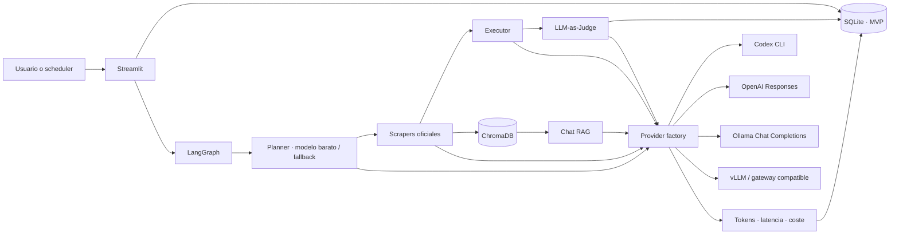

# CENtinela

Plataforma de inteligencia regulatoria para el Sistema Eléctrico Nacional
(SEN) de Chile, orientada a activos solares, BESS, hidrógeno verde y data
centers. Captura publicaciones oficiales, genera informes diarios trazables,
permite consultas RAG, gestiona alertas por usuario y registra tokens, latencia
y atribución económica por ejecución.

El runtime de IA es intercambiable: **Codex con una sesión ChatGPT, OpenAI API,
Ollama o vLLM/OpenAI-compatible**. Codex continúa siendo el perfil
predeterminado y validado de la entrega; Ollama ofrece una réplica local sin API
key y vLLM constituye la ruta recomendada para inferencia privada con GPU en
cloud.

## Capacidades

- Login propio con PBKDF2-HMAC-SHA256 y sal individual.
- Captura resiliente de CEN, CNE, Ministerio de Energía, SEC, SEA, Senado y
  Cámara de Diputadas y Diputados.
- Dashboard con noticias, cobertura, temas, fechas y URLs originales.
- Alertas persistentes por usuario, palabras clave y organismo.
- Grafo LangGraph fijo y auditable:
  `Planner -> Scraper -> Executor -> LLM-as-Judge -> END`.
- Provider factory por rol, manteniendo inyección de dobles para pruebas.
- RAG persistente en ChromaDB con embeddings locales, OpenAI u Ollama/vLLM.
- Citas obligatorias `[Fuente | URL]` y validación local contra el catálogo de
  evidencia; el modelo no puede introducir una URL desconocida.
- Informes descargables en Markdown y JSON.
- Observabilidad por llamada, nodo y ejecución: modelo, proveedor, latencia,
  estado, `prompt_tokens`, `completion_tokens`, USD y CLP.
- Coste API, suscripción Codex y cómputo self-hosted diferenciados.
- Docker endurecido y perfiles reproducibles para Codex y Ollama.

## Arquitectura



La topología del agente no cambia al cambiar de modelo. Executor y Judge solo
reciben un catálogo acotado de documentos. Tras cada salida se ejecuta una
barrera determinista de citas; un fallo del Judge deja el informe rechazado y
no lo guarda como memoria válida.

## Modos de IA

| Proveedor | Transporte | Identidad | Uso recomendado | Facturación mostrada |
|---|---|---|---|---|
| `codex` | `codex exec` JSONL | sesión ChatGPT/Codex | demo y evaluación individual | suscripción, coste por llamada N/A |
| `openai` | OpenAI Responses API | `OPENAI_API_KEY` | servicio gestionado | coste por tokens en USD/CLP |
| `ollama` | Chat Completions y embeddings compatibles | red privada | desarrollo, edge y piloto | API 0; cómputo separado |
| `vllm` | endpoint OpenAI-compatible | API key del gateway | cloud privado con GPU | API 0; cómputo separado |

`AI_PROVIDER` define el backend general. `PLANNER_PROVIDER`,
`FILTER_PROVIDER`, `REPORT_PROVIDER` y `JUDGE_PROVIDER` permiten routing
híbrido. `EMBEDDING_PROVIDER` se configura independientemente, por ejemplo
OpenAI para generación y Ollama para mantener los vectores dentro de la red.

### Routing predeterminado

El perfil Codex mantiene Planner y filtro deterministas para evitar dos procesos
CLI sobre decisiones acotadas. Los perfiles OpenAI, Ollama y vLLM activan ambos
roles con el modelo barato configurado y vuelven al resultado determinista si la
salida falla. Así, la ruta OpenAI usa efectivamente `gpt-4o-mini` para
planificación/filtrado y `gpt-4o` para el informe final. El modelo de filtro
también redacta el chat RAG.

| Rol | Codex | OpenAI API | Ollama demo | vLLM inicial |
|---|---|---|---|---|
| Planner/filtro | `gpt-5.6-luna` | `gpt-4o-mini` | `qwen3.5:9b` | `Qwen/Qwen3.5-9B` |
| Chat RAG | `gpt-5.6-luna` | `gpt-4o-mini` | `qwen3.5:9b` | `Qwen/Qwen3.5-9B` |
| Informe | `gpt-5.6-sol` | `gpt-4o` | `qwen3.5:9b` | `Qwen/Qwen3.5-9B` |
| Judge | `gpt-5.6-terra` | `gpt-4o-mini` | `qwen3.5:9b` | `Qwen/Qwen3.5-9B` |
| Embeddings | `local-hash-1536` | `text-embedding-3-small` | `qwen3-embedding:0.6b` | configurable |

El perfil Ollama usa un único modelo generativo para limitar RAM/VRAM. No se
afirma que sea equivalente a Sol o GPT-4o: debe promocionarse por rol tras un
benchmark regulatorio chileno. Un despliegue vLLM suele servir un modelo por
instancia; para modelos distintos se necesitan endpoints por rol o un gateway
que enrute por nombre.

## RAG trazable

El modo predeterminado `local_hash` combina palabras, bigramas y trigramas con
hashing firmado y vectores L2 de 1.536 dimensiones. Es reproducible, no descarga
pesos y resulta útil para terminología exacta como BESS, PMGD o precio de nudo.
Ollama, vLLM y OpenAI permiten embeddings neuronales mediante `/v1/embeddings`.

Cada fragmento conserva organismo, URL primaria, título, fecha, temas, índice,
hash documental e identidad `proveedor/modelo` del embedding. Un cambio de
espacio vectorial fuerza la reindexación y evita mezclar vectores incompatibles.
La respuesta RAG se construye desde IDs de evidencia y CENtinela inserta las
citas verificadas, en lugar de confiar URLs redactadas libremente por el modelo.

## Estructura

```text
CENtinela/
├── app.py
├── core/
│   ├── codex_client.py
│   ├── config.py
│   ├── database.py
│   ├── observability.py
│   └── providers/
│       ├── base.py
│       ├── factory.py
│       └── openai_compatible.py
├── scrapers/chile_regulatory.py
├── agent/{state.py,tools.py,graph.py}
├── rag/vector_engine.py
├── tests/
├── docs/demo/
├── Dockerfile
├── docker-compose.yml
├── docker-compose.ollama.yml
├── docker-compose.ollama-gpu.yml
├── CLOUD_ARCHITECTURE.md
├── DECISIONES_TECNICAS.md
└── SECURITY.md
```

## Fuentes públicas

| Organismo | Cobertura | URL oficial |
|---|---|---|
| Coordinador Eléctrico Nacional | operación, transmisión y procedimientos | <https://www.coordinador.cl/novedades/> |
| Comisión Nacional de Energía | normativa, tarifas, precios y licitaciones | <https://www.cne.cl/prensa/> |
| Ministerio de Energía | política, reglamentos y planes | <https://energia.gob.cl/noticias> |
| SEC | fiscalización, instrucciones y seguridad | <https://www.sec.cl/> |
| SEA | evaluación ambiental, guías y criterios | <https://www.sea.gob.cl/noticias> |
| Senado | actividad legislativa y comisiones | <https://www.senado.cl/> |
| Cámara | proyectos, comisiones y prensa | <https://www.camara.cl/> |

Si una fuente bloquea el acceso, el scraper puede usar `r.jina.ai` como proxy de
lectura de esa misma página. El registro queda marcado como fallback y la cita
sigue apuntando a la URL oficial. Nunca se fabrican noticias para completar
cobertura.

## Instalación local

Requisitos: Python 3.12, acceso HTTPS a las fuentes y credenciales o endpoint
del proveedor elegido.

```bash
python3 -m venv .venv
source .venv/bin/activate
python -m pip install --upgrade pip
pip install -r requirements-dev.txt
cp .env.example .env
streamlit run app.py
```

Abre <http://127.0.0.1:8501>. El primer usuario puede registrarse desde la UI o
definirse con ambas variables `DEFAULT_ADMIN_USERNAME` y
`DEFAULT_ADMIN_PASSWORD` en desarrollo. Las rutas relativas se resuelven desde
la raíz del repositorio.

## Docker con Codex

```bash
cp .env.example .env
docker compose up -d --build
docker compose exec centinela codex login --device-auth
docker compose exec centinela codex login status
docker compose ps
```

La URL y el código de un solo uso se autorizan con la cuenta ChatGPT. La sesión
queda en `centinela-codex-auth`; contiene tokens y debe tratarse como un secreto.
El CLI ejecuta cada turno en un workdir aislado, sin shell interactiva, con red
y escritura denegadas para los comandos que pudiera proponer el modelo.

Codex es apropiado para esta evaluación, pero una sesión humana no es la
identidad recomendada para réplicas cloud desatendidas. En cloud debe elegirse
OpenAI API o un gateway privado vLLM, con una identidad de servicio gestionada.

## Docker con Ollama

La primera ejecución descarga `qwen3.5:9b` y
`qwen3-embedding:0.6b`; necesita varios GB y puede tardar.

El perfil fija Ollama `0.32.5` por digest: Qwen 3.5 requiere una versión
`0.17.1` o posterior y una imagen antigua hace fallar el bootstrap al descargar
el modelo.

```bash
cp .env.example .env
docker compose \
  -f docker-compose.yml \
  -f docker-compose.ollama.yml \
  up --build
```

La UI queda en <http://127.0.0.1:8501> y Ollama solo se enlaza a loopback en
<http://127.0.0.1:11434>. El backend de Ollama no debe publicarse directamente
en Internet porque su API local no incorpora autenticación. Para Linux con
NVIDIA Container Toolkit:

```bash
docker compose \
  -f docker-compose.yml \
  -f docker-compose.ollama.yml \
  -f docker-compose.ollama-gpu.yml \
  up --build
```

En Docker Desktop para macOS funciona el perfil base, aunque la inferencia CPU
puede ser lenta. Consulta [CLOUD_ARCHITECTURE.md](CLOUD_ARCHITECTURE.md) para
capacidad, GPU, gateway, seguridad y SLO.

## OpenAI API

La API se factura separadamente de ChatGPT Plus/Pro/Business. Inyecta la clave
desde un gestor de secretos en producción; no la confirmes en Git.

```dotenv
AI_PROVIDER=openai
EMBEDDING_PROVIDER=openai
OPENAI_API_KEY=<inyectada-como-secreto>
OPENAI_BASE_URL=https://api.openai.com/v1
```

OpenAI utiliza Responses API con `store=false`. Las salidas estructuradas usan
JSON Schema. `gpt-4o-mini` cubre planificación, filtrado, RAG y Judge; `gpt-4o`
redacta el informe final, como exige el enunciado de la prueba.

## vLLM / endpoint compatible

```dotenv
AI_PROVIDER=vllm
EMBEDDING_PROVIDER=ollama
VLLM_BASE_URL=https://llm.internal.example/v1
VLLM_API_KEY=<token-del-gateway>
VLLM_REPORT_MODEL=Qwen/Qwen3.5-27B
VLLM_JUDGE_MODEL=mistralai/Mistral-Small-3.1-24B-Instruct-2503
OLLAMA_BASE_URL=http://embedding-service:11434/v1
```

El endpoint debe permanecer tras TLS, autenticación de servicio, cuotas,
timeouts y límites de contexto. Si el gateway no enruta por nombre, configura
el mismo modelo en todos los roles o despliega endpoints separados.

## Configuración principal

| Variable | Default | Propósito |
|---|---|---|
| `AI_PROVIDER` | `codex` | `codex`, `openai`, `ollama` o `vllm` |
| `EMBEDDING_PROVIDER` | `local_hash` | espacio vectorial independiente |
| `*_PROVIDER` | vacío | override opcional por rol |
| `PROVIDER_TIMEOUT_SECONDS` | `240` | timeout de inferencia HTTP |
| `CODEX_CLI_PATH` | `codex` | CLI, con fallback al binario empaquetado |
| `OPENAI_BASE_URL` | API oficial | endpoint Responses |
| `OLLAMA_BASE_URL` | loopback | endpoint Ollama compatible |
| `VLLM_BASE_URL` | loopback | gateway/servidor vLLM |
| `*_PLANNER_MODEL` | según proveedor | modelo de planificación |
| `*_FILTER_MODEL` | según proveedor | filtro y chat RAG |
| `*_REPORT_MODEL` | según proveedor | informe final |
| `*_JUDGE_MODEL` | según proveedor | barrera LLM-as-Judge |
| `*_EMBEDDING_MODEL` | según proveedor | embeddings remotos |
| `SELF_HOSTED_COMPUTE_USD_PER_HOUR` | vacío | estimación separada de CPU/GPU |
| `DATABASE_PATH` | `data/centinela.db` | SQLite del MVP |
| `CHROMA_PATH` | `data/chroma` | índice vectorial |
| `REPORTS_PATH` | `reports` | exportaciones |
| `USD_TO_CLP` | `940` | cambio contractual fijo |
| `BUSINESS_TIMEZONE` | `America/Santiago` | fecha civil del informe |

El contrato completo, incluidos los modelos por proveedor, está documentado en
[.env.example](.env.example). `Settings.public_dict()` excluye todas las claves.

## Observabilidad y tokenomics

Los adaptadores convierten el uso nativo de cada backend a los campos exactos
`prompt_tokens` y `completion_tokens` y lo emiten al callback LangChain. Si un
backend no entrega uso, CENtinela registra cero, marca
`token_usage_status=not_reported` y no estima por longitud. Los embeddings
remotos emiten su consumo de entrada por lote al mismo callback.

- OpenAI API: aplica el precio configurado por millón de tokens y convierte a
  CLP con `1 USD = 940 CLP`.
- Codex: conserva tokens, marca `billing_mode=subscription` y muestra coste por
  llamada N/A. Cero en el esquema no significa servicio gratuito.
- Ollama/vLLM: marca `billing_mode=self_hosted`; el coste API es cero y el coste
  de infraestructura queda como no configurado o como estimación por hora.

Las estimaciones de cómputo nunca se suman al coste API exacto. Para producción,
la métrica comparable es coste amortizado por informe y consulta RAG, incluyendo
GPU/CPU, memoria, energía y overhead.

## Seguridad

- Prompts, claves, contraseñas y cuerpos de error sensibles se sanitizan antes
  de persistirse.
- Los endpoints configurados deben ser HTTP(S) absolutos y no pueden incorporar
  usuario, contraseña, query ni fragment.
- El contenido web se trata como datos no confiables y no como instrucciones.
- Las citas solo se aceptan si la URL existe en el catálogo recuperado.
- Ollama y vLLM deben permanecer en red privada detrás de un gateway.
- La imagen usa un usuario no privilegiado, root filesystem de solo lectura,
  `no-new-privileges`, capabilities eliminadas y volúmenes explícitos.
- `docker compose down -v` elimina datos, informes, pesos y autenticación; no lo
  uses si necesitas conservar el entorno.

Consulta [SECURITY.md](SECURITY.md) para el modelo de amenazas. El login local
del MVP no sustituye SSO/OIDC, RBAC ni un secret manager de producción.

## Validación manual

1. Crea un usuario e inicia sesión.
2. En **Dashboard**, pulsa **Actualizar fuentes** y abre varias URLs.
3. En **Alertas**, guarda una regla con BESS, almacenamiento y precio de nudo.
4. En **Informe diario**, genera un informe y revisa citas y dictamen del Judge.
5. En **Chat RAG**, pregunta qué cambios afectan a almacenamiento y transmisión.
6. En **Observabilidad**, contrasta backend, modelos, tokens, latencia y coste.
7. En **Arquitectura**, verifica el routing efectivo de ese despliegue.

`docs/demo/` conserva capturas y artefactos de una ejecución Codex real de
aceptación. Son evidencia estática para revisar la interfaz sin consumir cuota;
no incluyen SQLite, usuarios, contraseñas, índices ni credenciales.

## Pruebas

```bash
python -m compileall -q app.py core scrapers agent rag scripts
ruff check .
pip-audit -r requirements.txt --progress-spinner off
pytest -q
docker compose config --quiet
docker compose -f docker-compose.yml -f docker-compose.ollama.yml config --quiet
```

La suite usa endpoints falsos y clientes inyectados; comprueba contratos
Responses/Chat Completions, JSON Schema, tokens, coste, seguridad, grafo, citas,
RAG, parsers y frontend sin consumir cuota ni descargar modelos. La captura
online de fuentes se ejecuta por separado:

```bash
python -m scrapers.chile_regulatory --max-per-source 1
```

El benchmark sintético de grounding realiza llamadas reales y debe ejecutarse
solo con el proveedor ya configurado:

```bash
python scripts/evaluate_provider.py --provider ollama --role filter
```

Sirve como smoke de contrato, JSON, citas, términos, latencia y tokens; no
sustituye el conjunto dorado jurídico/regulatorio de producción.

## Alcance productivo

El repositorio es un MVP ejecutable y defendible, no una plataforma HA ya
terminada. Para producción se deben completar PostgreSQL, vector store con
backup, workers y cola, SSO/OIDC, RBAC, secret manager, auditoría inmutable,
monitorización externa, evaluación dorada y despliegue de modelos por digest.
El roadmap y las decisiones están en
[DECISIONES_TECNICAS.md](DECISIONES_TECNICAS.md) y
[CLOUD_ARCHITECTURE.md](CLOUD_ARCHITECTURE.md).

## Diagnóstico rápido

- **Codex no autenticado:** `docker compose exec centinela codex login status`.
- **OpenAI deshabilitado:** confirma que `OPENAI_API_KEY` llega al contenedor y
  que el proyecto API tiene saldo/límites disponibles.
- **Ollama no listo:** revisa `docker compose ... ps`, el bootstrap y
  `curl http://127.0.0.1:11434/v1/models`.
- **Modelo ausente:** el health check exige que aparezca en `/v1/models`.
- **Chat o informe bloqueado:** Executor/RAG y Judge deben estar listos; la UI no
  presenta un fallback determinista como si fuera una respuesta generativa.
- **Índice vacío:** actualiza las fuentes antes de sincronizar Chroma.
- **Contadores en cero:** comprueba que el backend publique `usage`; cero no
  demuestra ausencia de consumo.

CENtinela es inteligencia asistida, no asesoramiento jurídico ni una decisión
autónoma de inversión. La cita acredita procedencia; la interpretación y
aplicabilidad deben validarse por un especialista.
