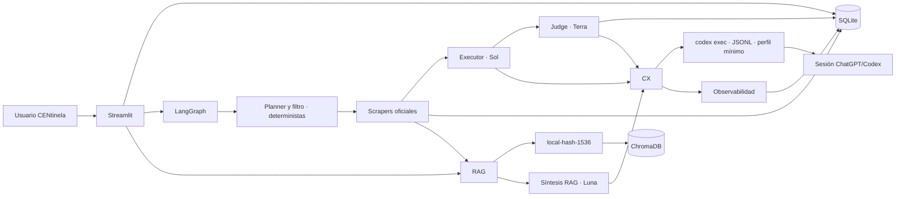

# CENtinela

Plataforma de inteligencia regulatoria para el Sistema Eléctrico Nacional (SEN)
de Chile, orientada a activos solares, BESS, hidrógeno verde y data centers.
CENtinela captura publicaciones oficiales, genera informes diarios trazables,
permite consultas RAG, gestiona alertas por usuario y registra el consumo de
tokens de cada ejecución.

Esta versión funciona exclusivamente con **Codex CLI autenticado mediante una
cuenta de ChatGPT/Codex**. No usa `OPENAI_API_KEY`, endpoints de OpenAI Platform
ni embeddings remotos.

## Capacidades

- Login propio de la aplicación con PBKDF2-HMAC-SHA256 y sal individual.
- Captura resiliente de CEN, CNE, Ministerio de Energía, SEC, SEA, Senado y
  Cámara de Diputadas y Diputados.
- Dashboard con noticias, cobertura por organismo, temas, fechas y URLs
  originales.
- Alertas persistentes por usuario y palabras clave.
- Agente LangGraph con flujo fijo
  `Planner -> Scraper -> Executor -> LLM-as-Judge -> END`.
- Routing Codex por valor: Planner y filtrado deterministas por defecto, Luna
  para RAG, Sol para la síntesis final y Terra para la evaluación.
- RAG persistente en ChromaDB con embeddings `local-hash-1536`, deterministas y
  sin descarga de modelos.
- Citas obligatorias `[Fuente | URL]` y validación local de procedencia.
- Informes descargables en Markdown y JSON.
- Observabilidad por ejecución: modelo, rol, latencia, estado,
  `prompt_tokens`, `completion_tokens` y atribución económica explícita.

## Arquitectura



Hay dos identidades distintas:

1. El usuario de Streamlit controla sus alertas, informes y sesiones dentro de
   CENtinela.
2. La sesión ChatGPT/Codex autoriza las llamadas generativas que ejecuta el
   backend mediante `codex exec`.

El adaptador de Codex envía el prompt por `stdin`, solicita eventos JSONL, usa
sesiones efímeras y ejecuta el agente con el perfil mínimo de solo lectura
`centinela_runtime`. No lee ni expone directamente el fichero de credenciales.
El grafo delimita los documentos recuperados como datos no confiables y solo
permite redactar con el catálogo de evidencia de la ejecución.

## Routing de modelos

| Rol | Modelo | Esfuerzo | Responsabilidad |
|---|---|---:|---|
| Planner | determinista | — | Plan breve y prioridades sin llamada |
| Filtro | determinista | — | Selección acotada de evidencia sin llamada |
| Chat RAG | `gpt-5.6-luna` | `low` | Respuesta sobre fragmentos recuperados |
| Executor | `gpt-5.6-sol` | `high` | Informe ejecutivo final |
| LLM-as-Judge | `gpt-5.6-terra` | `medium` | Rúbrica de calidad y trazabilidad |

Los slugs generativos se pasan explícitamente al CLI y deben estar disponibles
para la cuenta o workspace autenticado. La configuración del usuario de Codex
se ignora durante las ejecuciones para que el routing sea reproducible. Las
variables de Planner y filtro se conservan como configuración compatible, pero
el flujo entregado resuelve ambos pasos localmente por defecto.

## RAG local y trazable

`rag/vector_engine.py` combina palabras normalizadas, bigramas y trigramas de
caracteres mediante hashing firmado. Produce vectores L2 de 1.536 dimensiones,
sin red, claves ni artefactos externos. ChromaDB aplica distancia coseno.

Cada fragmento conserva:

- organismo y URL primaria;
- título, fecha, temas e índice del fragmento;
- hash de la versión documental;
- versión del algoritmo de embedding.

Una versión documental sin cambios no se recalcula. Al cambiar el algoritmo,
los fragmentos se reindexan para evitar mezclar espacios vectoriales. Este
método favorece terminología regulatoria concreta y reproducibilidad; no tiene
la generalización semántica de un embedding neuronal. Su calidad debe medirse
con Recall@k sobre preguntas revisadas por especialistas.

## Estructura del repositorio

```text
CENtinela/
├── app.py
├── core/
│   ├── codex_client.py
│   ├── config.py
│   ├── database.py
│   └── observability.py
├── scrapers/
│   └── chile_regulatory.py
├── agent/
│   ├── state.py
│   ├── tools.py
│   └── graph.py
├── rag/
│   └── vector_engine.py
├── tests/
├── docs/demo/
│   ├── screenshots/
│   ├── sample-report.md
│   ├── sample-report.json
│   ├── sample-rag.json
│   └── validation-summary.json
├── .streamlit/config.toml
├── .env.example
├── requirements.txt
├── requirements-dev.txt
├── Dockerfile
├── docker-compose.yml
├── AI_USAGE.md
├── SECURITY.md
├── DEFENSA_CTO.md
├── DECISIONES_TECNICAS.md
└── README.md
```

## Fuentes públicas

| Organismo | Cobertura primaria | URL oficial |
|---|---|---|
| Coordinador Eléctrico Nacional (CEN) | Operación, transmisión y procedimientos del SEN | <https://www.coordinador.cl/novedades/> |
| Comisión Nacional de Energía (CNE) | Normativa, tarificación, precios de nudo y licitaciones | <https://www.cne.cl/prensa/> |
| Ministerio de Energía | Política, reglamentos, planes y legislación | <https://energia.gob.cl/noticias> |
| Superintendencia de Electricidad y Combustibles (SEC) | Fiscalización, instrucciones y seguridad | <https://www.sec.cl/> |
| Servicio de Evaluación Ambiental (SEA) | Evaluación ambiental, guías y criterios | <https://www.sea.gob.cl/noticias> |
| Senado | Actividad legislativa y Comisión de Minería y Energía | <https://www.senado.cl/> |
| Cámara de Diputadas y Diputados | Proyectos, comisiones y prensa legislativa | <https://www.camara.cl/> |

Cada registro mantiene título, contenido, organismo, URL original, URL de la
fuente, fechas, temas y método de captura. Si una fuente bloquea el acceso, el
MVP puede usar `r.jina.ai` como proxy de lectura en vivo de esa misma página.
El registro queda marcado como fallback y la cita sigue apuntando a la URL
oficial. Nunca se fabrican noticias para completar cobertura.

## Requisitos

- Python 3.12.
- Acceso HTTPS a las fuentes regulatorias y al servicio de Codex.
- Cuenta de ChatGPT con acceso a Codex y a los modelos configurados.
- Docker 24+ y Docker Compose v2 para la ruta contenerizada.
- Device Code Login habilitado en la cuenta o por el administrador del
  workspace si se usa Docker/headless.

Codex admite login con ChatGPT y reutiliza la sesión guardada del CLI. La
documentación oficial describe el flujo local y `--device-auth` para entornos
headless en [Authentication](https://learn.chatgpt.com/docs/auth). CENtinela no
admite autenticación por API key.

## Instalación local

Desde la raíz del repositorio:

```bash
python3 -m venv .venv
source .venv/bin/activate
python -m pip install --upgrade pip
pip install -r requirements-dev.txt
cp .env.example .env
```

`requirements.txt` contiene solo el runtime de producción;
`requirements-dev.txt` añade la versión corregida de `pytest` usada por la
suite y CI. Si solo vas a ejecutar la aplicación, instala el primero.

Autentica el CLI con ChatGPT y verifica la sesión:

```bash
export CODEX_CLI_PATH="$(python -c 'from codex_cli_bin import bundled_codex_path; print(bundled_codex_path())')"
"$CODEX_CLI_PATH" login
"$CODEX_CLI_PATH" login status
```

El paquete `openai-codex` fija la versión del CLI y expone su binario mediante
`codex_cli_bin`. Al arrancar, CENtinela resuelve primero `CODEX_CLI_PATH`/`PATH`
y, si el valor portable `codex` no existe, utiliza automáticamente ese binario
empaquetado. El `export` anterior solo permite invocarlo manualmente durante el
primer login. Una ruta explícita distinta nunca se reemplaza silenciosamente.

Arranca CENtinela:

```bash
streamlit run app.py
```

Abre <http://127.0.0.1:8501>. Puedes crear el primer usuario en **Crear
cuenta** o definir conjuntamente `DEFAULT_ADMIN_USERNAME` y
`DEFAULT_ADMIN_PASSWORD` antes de arrancar. La contraseña se almacena derivada,
nunca en texto claro.

Atajos disponibles:

```bash
make install
make test
make compile
make run
```

## Ejecución con Docker y device authentication

Construye y levanta el servicio:

```bash
cp .env.example .env
docker compose up -d --build
```

Inicia sesión desde el contenedor:

```bash
docker compose exec centinela codex login --device-auth
```

El comando mostrará una URL y un código de un solo uso. Abre la URL, inicia
sesión con la cuenta de ChatGPT autorizada e introduce el código. Después
verifica el estado:

```bash
docker compose exec centinela codex login status
docker compose ps
```

Abre <http://127.0.0.1:8501>.

Compose persiste cuatro ámbitos:

- `centinela-data`: SQLite y directorio de trabajo aislado de Codex.
- `centinela-chroma-v063`: índice ChromaDB embebido.
- `centinela-reports`: informes Markdown/JSON.
- `centinela-codex-auth`: caché autenticado montado en
  `/home/centinela/.codex` mediante `CODEX_HOME`.

El volumen de autenticación es escribible para que el CLI pueda renovar la
sesión. Contiene tokens: debe tratarse como un secreto, limitarse a la máquina y
usuarios Docker autorizados, quedar fuera de copias no cifradas y no montarse en
otros contenedores. No copies `~/.codex/auth.json` al repositorio, a la imagen ni
a un ticket. La guía oficial también exige tratar ese fichero como una
contraseña.

La imagen ejecuta la aplicación con el usuario no privilegiado `centinela`
(UID 10001). Durante el build se crean `data/`, `data/chroma/`,
`data/codex-work/` y `reports/` con ese propietario para que los volúmenes
nuevos sean utilizables sin ejecutar el servicio como root.

Compose ejecuta además el root filesystem en solo lectura, elimina todas las
capabilities Linux, activa `no-new-privileges`, limita procesos y reserva un
`tmpfs` acotado para temporales. Solo los cuatro volúmenes declarados conservan
escritura y persistencia.

ChromaDB 0.6.3 no puede abrir de forma fiable un índice creado por 1.5.x. El
mount dedicado `centinela-chroma-v063` evita una migración destructiva: si ya
existía un índice 1.x dentro de `centinela-data`, permanece intacto y oculto
bajo el nuevo mount. El índice 0.6.3 se reconstruye desde las noticias de
SQLite al pulsar **Actualizar fuentes**. No elimines el volumen anterior hasta
haber verificado la reconstrucción.

Operaciones habituales:

```bash
# Logs de la aplicación
docker compose logs -f centinela

# Estado de autenticación
docker compose exec centinela codex login status

# Cerrar la sesión almacenada en el volumen
docker compose exec centinela codex logout

# Detener sin borrar datos ni autenticación
docker compose down
```

`docker compose down -v` elimina datos, informes y autenticación; no debe usarse
si se necesita conservar el entorno.

## Configuración

| Variable | Valor por defecto | Propósito |
|---|---:|---|
| `CODEX_CLI_PATH` | `codex` | Ejecutable usado; fallback automático al binario de `openai-codex` |
| `CODEX_TIMEOUT_SECONDS` | `240` | Timeout máximo por turno Codex |
| `CODEX_WORKDIR` | `data/codex-work` | Directorio aislado de ejecución |
| `PLANNER_MODEL` | `gpt-5.6-luna` | Compatibilidad; Planner determinista por defecto |
| `FILTER_MODEL` | `gpt-5.6-luna` | Síntesis RAG; filtro determinista por defecto |
| `JUDGE_MODEL` | `gpt-5.6-terra` | LLM-as-Judge |
| `REPORT_MODEL` | `gpt-5.6-sol` | Redacción del informe |
| `PLANNER_REASONING_EFFORT` | `low` | Esfuerzo del Planner |
| `FILTER_REASONING_EFFORT` | `low` | Esfuerzo de filtro/RAG |
| `JUDGE_REASONING_EFFORT` | `medium` | Esfuerzo del Judge |
| `REPORT_REASONING_EFFORT` | `high` | Esfuerzo del Executor |
| `EMBEDDING_MODEL` | `local-hash-1536` | Identidad del embedding local |
| `DATABASE_PATH` | `data/centinela.db` | SQLite |
| `CHROMA_PATH` | `data/chroma` | Índice vectorial |
| `REPORTS_PATH` | `reports` | Exportaciones |
| `USD_TO_CLP` | `940` | Tipo contractual conservado en el esquema |
| `SCRAPER_TIMEOUT_SECONDS` | `15` | Timeout por petición |
| `SCRAPER_MAX_ARTICLES` | `8` | Límite por fuente y ejecución |
| `RAG_TOP_K` | `5` | Fragmentos recuperados |
| `APP_NAME` | `CENtinela` | Nombre visible del servicio |
| `APP_ENV` | `development` | Perfil operativo |
| `LOG_LEVEL` | `INFO` | Nivel de logs sanitizados |
| `BUSINESS_TIMEZONE` | `America/Santiago` | Fecha civil de informes |
| `DEFAULT_ADMIN_USERNAME` | vacío | Bootstrap local opcional |
| `DEFAULT_ADMIN_PASSWORD` | vacío | Contraseña bootstrap opcional |

No existe `OPENAI_API_KEY` en la configuración. Las rutas relativas se
resuelven desde la raíz del proyecto.

## Frontera de seguridad del runtime Codex

Cada `codex exec` recibe su política por configuración inline y se ejecuta con
`--strict-config`, sin mezclar el antiguo flag `--sandbox` con perfiles de
permisos:

- `forced_login_method="chatgpt"` rechaza una sesión basada en API key;
- el perfil `centinela_runtime` solo concede lectura a `:minimal` y al
  `CODEX_WORKDIR` dedicado;
- `/app`, la raíz del proyecto y `CODEX_HOME` quedan denegados, aunque el
  subdirectorio de trabajo más específico se encuentre bajo `/app`;
- los comandos propuestos por el modelo no tienen escritura ni red y reciben
  un entorno vacío salvo un `PATH` mínimo;
- `approval_policy="never"` impide ampliar permisos en una ejecución
  desatendida.

El proceso principal del CLI conserva acceso a su sesión para comunicarse con
el servicio Codex; esa credencial no es legible por los comandos sandboxed ni
se copia al repositorio. La pantalla de estado solo considera válida la salida
explícita `Logged in using ChatGPT`.

## Observabilidad, tokens y atribución económica

`CodexClient` consume el flujo JSONL de `codex exec`. Del evento
`turn.completed.usage` obtiene, sin estimaciones por longitud:

- `prompt_tokens`/`input_tokens`;
- `completion_tokens`/`output_tokens`;
- tokens de entrada cacheados;
- tokens de razonamiento, cuando están disponibles;
- modelo solicitado, latencia, estado y error sanitizado.

El panel y SQLite persisten los contadores contractuales de entrada y salida;
`CodexResult` conserva además caché y razonamiento para consumidores que los
necesiten. Los contadores mostrados son los reportados por el CLI. Si una versión
no publica `usage`, CENtinela no inventa una cifra; esa ejecución requiere
diagnóstico o reconciliación fuera del panel.

La autenticación ChatGPT/Codex consume la cuota y está sujeta a los límites y al
plan del workspace, pero no proporciona un precio de OpenAI Platform atribuible
a cada llamada. Por ese motivo:

```text
cost_usd = 0
cost_clp = 0
billing_mode = subscription
cost_attribution = not_attributable
```

Los ceros mantienen el contrato de datos y significan **“sin coste API
atribuible por llamada”**, no “servicio gratuito” ni “coste económico total
cero”. La suscripción, límites, descuentos y costes operativos quedan fuera de
esa cifra. El cambio `1 USD = 940 CLP` se conserva por compatibilidad con el
ejercicio, pero no convierte una atribución inexistente en un coste real. El
panel admite además una imputación interna opcional de la suscripción en
USD/CLP; se etiqueta como estimación interna y nunca como tarifa API de OpenAI.

## Recorrido de validación manual

1. Crea un usuario e inicia sesión.
2. En **Dashboard**, pulsa **Actualizar fuentes** y abre varias URLs.
3. En **Alertas**, guarda una regla con `BESS`, `almacenamiento`, `transmisión` y
   `precios de nudo`.
4. En **Informe diario**, genera un informe y revisa citas y Judge.
5. En **Chat RAG**, pregunta: “¿Qué novedades pueden afectar a almacenamiento y
   transmisión?”.
6. En **Observabilidad**, contrasta modelos, tokens, duración, estado y metadata
   de atribución.

## Evidencia reproducible incluida

`docs/demo/` conserva una ejecución real de aceptación realizada el 13 de
agosto de 2026 sobre las siete fuentes configuradas. Incluye:

- una galería de las nueve pantallas principales;
- un informe diario aprobado por Terra con 78/100 y validación determinista;
- la exportación Markdown/JSON del informe y su catálogo de citas;
- una consulta RAG real sobre CNE y SEA, con fuentes originales;
- el resumen de pruebas, cobertura, tokens y latencia observados.

Los artefactos son evidencia estática para revisar la solución sin consumir
cuota. No incluyen SQLite, el índice Chroma, usuarios, contraseñas ni la sesión
de ChatGPT/Codex. Los resultados en vivo pueden variar porque las fuentes y los
modelos evolucionan; la metodología, los validadores y las trazas son
reproducibles.

## Pruebas

```bash
python -m compileall -q app.py core scrapers agent rag
pytest -q
```

La suite determinista usa clientes Codex falsos, HTML/XML simulado, Chroma
temporal y directorios aislados; no inicia sesión, no consume cuota y no depende
de internet. `pytest` y `tests/` se excluyen deliberadamente de la imagen de
runtime; la validación se ejecuta en el entorno local de desarrollo o en CI con
`requirements-dev.txt`. La prueba online de fuentes es deliberadamente
separada:

```bash
python -m scrapers.chile_regulatory --max-per-source 1
```

El paso Scraper queda trazado como nodo con estado, latencia y estadísticas de
cobertura; cada noticia conserva además URL, organismo, método y estado de
captura. El MVP no persiste todavía un span por petición HTTP individual. Esa
granularidad forma parte del roadmap de producción documentado en los ADRs.

## Persistencia y privacidad

- `data/centinela.db`: usuarios, alertas, noticias, ejecuciones e informes.
- `data/chroma/`: embeddings locales y metadatos regulatorios públicos.
- `data/codex-work/`: directorio de trabajo aislado, sin acceso de escritura al
  repositorio.
- `reports/`: exportaciones.
- `CODEX_HOME`: credenciales del CLI, separado de los datos de aplicación.

El MVP no contiene datos internos de Grenergy. Para producción se requieren
SSO/OIDC, RBAC, un almacén de secretos o mecanismo empresarial de acceso Codex,
cifrado, retención formal, auditoría inmutable y aislamiento por tenant.

## Diagnóstico rápido

- **“Codex no autenticado”:** ejecuta `codex login status` localmente o
  `docker compose exec centinela codex login status` en Docker.
- **Device auth no disponible:** habilítalo en la configuración de seguridad de
  ChatGPT o solicita al administrador del workspace que lo permita.
- **Modelo no disponible:** confirma que la cuenta tiene acceso a Luna, Terra y
  Sol; el error queda sanitizado en la ejecución.
- **Chat/informe bloqueado:** revisa la sesión, conectividad y límites de uso;
  la UI no inicia generación ni presenta un fallback como respuesta de IA sin
  una sesión ChatGPT/Codex válida. Dashboard, scraping, alertas e índice local
  permanecen operativos.
- **Índice vacío:** actualiza las fuentes antes de consultar el RAG.
- **Fuente bloqueada:** el resto continúa; revisa el error individual y el
  posible fallback de lectura.
- **Contadores en cero:** comprueba que la versión de Codex CLI publique
  `turn.completed.usage`; cero no implica ausencia de consumo.

## Alcance y decisiones

Los ADRs, riesgos y roadmap están en
[DECISIONES_TECNICAS.md](DECISIONES_TECNICAS.md). Consulta también la
[declaración de uso de IA](AI_USAGE.md), el [modelo de seguridad](SECURITY.md) y
el [guion de defensa ante CTO](DEFENSA_CTO.md).

CENtinela es inteligencia asistida, no asesoramiento jurídico ni una decisión
autónoma de inversión. La cita acredita procedencia; la interpretación y
aplicabilidad deben validarse por un especialista.
